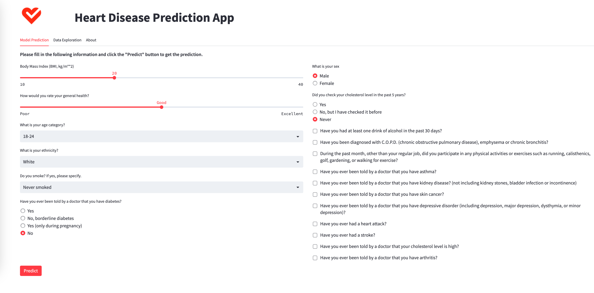

# Heart-Disease-Prediction


[Link to the web app](https://daniel-zm-fang-heart-disease-prediction-app-7du8eh.streamlitapp.com/)

Most of the information is moved to the About section of the web app.

## Goal
To train a ML classifier on the above dataset to predict whether a patient has heart disease or not. The classifer should have a high recall (also preferably high precision) because we want to predict all the patients with heart disease to be "Yes" (it's better to have more false positives than false negatives in this case because heart diease is a serious matter).

## Setup
To install the required packages, run the following command in the terminal:
```bash
pip install -r requirements.txt
```
Too run the app, run the following command in the terminal:
```bash
streamlit run app.py
```

## Dataset
Since the raw datsets are too large to be uploaded to GitHub (2.3 GB), I have only uploaded 10% of cleaned dataset for data exploration. The raw datasets can be downloaded from
[here](https://www.cdc.gov/brfss/annual_data/annual_data.htm). The datasets are downloaded in `.xpt` and converted to `.csv`.